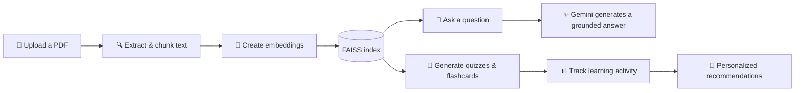

<div align="center">

# ✨ AI Learning Assistant

### Turn your learning materials into conversations, quizzes, flashcards, and a study plan made for you.

*An adaptive learning companion built in public with Python, Streamlit, Gemini, and RAG.*

<p>
  
  
  
  
</p>

</div>

---

## 🌱 What is this?

**AI Learning Assistant** helps learners study actively from their own PDF materials. Upload a document, ask questions grounded in its content, test yourself with generated quizzes, review flashcards, and see feedback that turns learning activity into a clearer next step.

This is a learning-in-public project. It is being built iteratively, with each milestone documented as the assistant grows from a simple RAG prototype into a genuinely adaptive study companion.

## 🚀 What it can do

| Feature | What it does |
| :--- | :--- |
| 📄 **PDF upload** | Bring your own learning material into the app. |
| 🔍 **Text extraction & chunking** | Break documents into useful, retrievable pieces of context. |
| 🧠 **Embeddings & FAISS retrieval** | Find the most relevant source material for each question. |
| 💬 **RAG chat** | Ask questions and receive answers based on your uploaded material. |
| 📝 **AI-generated quizzes** | Check understanding with questions created from the content. |
| 🎯 **Quiz scoring** | See how well you performed and where to improve. |
| 🃏 **Flashcards** | Generate cards for active recall and mark them as practised or mastered. |
| 📊 **Progress dashboard** | Track quiz and flashcard activity over time. |
| ✨ **Personalized recommendations** | Get practical guidance based on quiz performance and flashcard progress. |

## 🧭 How it works



## 🛠️ Built with

- **Python** for application logic
- **Streamlit** for a simple, interactive learning interface
- **Google Gemini API** for generation and embeddings
- **FAISS** for fast similarity search and retrieval
- **JSON** for lightweight local learning-history storage

## ⚡ Getting started

> Setup instructions will be refined alongside the public codebase. The intended local workflow is below.

1. Clone the repository.

   ```bash
   git clone <your-repository-url>
   cd ai-learning-assistant
   ```

2. Create and activate a virtual environment.

   ```bash
   python -m venv .venv
   source .venv/bin/activate
   ```

   On Windows, use `.venv\Scripts\activate` instead.

3. Install the project dependencies.

   ```bash
   pip install -r requirements.txt
   ```

4. Add your Gemini API key to your local environment. Never commit API keys or local learning data.

5. Start the app.

   ```bash
   streamlit run app.py
   ```

## 🎯 The learning loop

1. **Learn** from your own materials.
2. **Ask** questions when a concept is unclear.
3. **Practise** with quizzes and flashcards.
4. **Reflect** on your progress dashboard.
5. **Focus** on the next best area to improve.

## 🗺️ Roadmap

- [x] Document-based RAG chat
- [x] Quiz generation and scoring
- [x] Flashcard generation and tracking
- [x] Progress dashboard and recommendation engine
- [ ] Topic-level learning analysis
- [ ] Personalized study plans
- [ ] Stronger persistence and user profiles
- [ ] Deployment

## 🤝 Learning in public

This repository is a record of the build: experiments, implementation decisions, fixes, and lessons learned along the way. Feedback, ideas, and constructive contributions are welcome as the project evolves.

---

<div align="center">

Built with curiosity, one learning milestone at a time. 🌟

</div>
Learning Git and GitHub in public — first practice update. 🚀